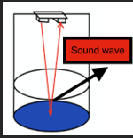
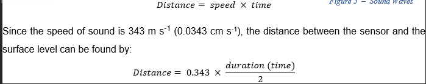
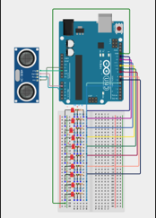
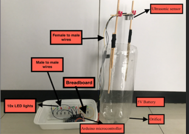

# Water-Level-Detector
For a physics research project investigating how the height of water level affect the flow rate of water through an orifice, there must be a way where the level of water can be measured accurately. The most obvious method would be to measure the time that the water level reaches a certain level by eye, but this would introduce additional errors and bias into the experiment. To mitigate this, I developed a device that uses Arduino and an ultrasonic sensor to gauge the distance between the device and the level of water. 

Note: A detailed write up about this experiment can be found in physics.pdf attached. 

## Set-up Explanation 

### Ultra-sonic sensor

The ultrasonic sensor emits a high frequency sound and it records the time taken to receive the reflected sound wave when an object or surface is detected.

The device utilises the equation, distance = speed x time to determine the distance between the sensor and the surface level of an object. The ultra-sonic also works for water surfaces; however, I found that rippling effects of the water can cause unstable calculations. To mitigate this, the average of of the distance over a certain period of time is calculated. 

### Arduino and wiring 
The breadboard includes 10 LED lights which are programmed to light up whenever the water level reaches the respective level.

In order to minimize the interference of anomalies to the validity of the data, the reading is outputted in the form of the average of the last 10 readings. The distance between the sensor and the top of the bottle surface was also considered by subtracting 8.8 cm <![if !msEquation]>  <![endif]> from the calculated distance value.

